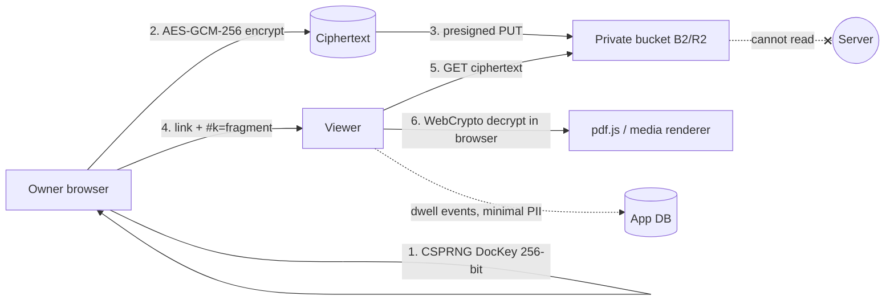

# BLINDSHARE 🔐📄

Zero-knowledge, brand-agnostic DocSend/Papermark alternative: secure document sharing with
per-page view analytics — designed to run entirely inside ₹0 free tiers.

> **Honest note:** watermarks, download-off and present-mode are **deterrents, not DRM**.
> This project has **not** been externally security-audited.

## Why it is different
Ordinary DocSend/Papermark store readable file bytes. BlindShare can run in
`DOCS_ENCRYPTION_MODE=e2ee-fragment` where the **server is a blind courier**:



The `#k=…` fragment is **never transmitted in an HTTP request** (RFC 3986 / browser behaviour),
so the server literally cannot decrypt.

## Quickstart
```bash
cp .env.example .env      # fill values — never commit .env
npm install
npx drizzle-kit push      # create tables
npm run dev
```
First registration uses `ADMIN_BOOTSTRAP_INVITE` and becomes `super_admin`.

## Feature map
- Client-side AES-GCM-256 encryption + fragment-key links
- Link studio: password (PBKDF2 250k wrap), e-mail gate, domain allowlist, NDA clickwrap,
  expiry, max-views, watermark toggle, download toggle, QR
- Viewer: pdf.js page-wise + image/SVG/Markdown/TXT/CSV/audio/video/bundle renderers
- Analytics: per-page dwell sparkline, completion %, UA class, coarse country, CSV export
- Admin panel `/admin`: users, roles, invites, audit log, storage gauge, budget ledger,
  maintenance mode, broadcast banner, orphan-object sweeps
- PWA shell, HI + EN UI, GDPR-lite export/delete, `/api/health` deep check

## Fragment-key proof test
1. Open DevTools → Network, load a share link with `#k=…`.
2. Inspect the request line of `/v/<slug>` and `/api/v/<slug>/bytes`.
3. The fragment appears in **no** request URL, `Referer`, or POST body. See `docs/RUNBOOK.md`.

## Docs pack
`docs/ARCHITECTURE.md` · `docs/THREAT-MODEL.md` · `docs/SECURITY.md` · `docs/PRIVACY-POLICY.md`
· `docs/TERMS.md` · `docs/DATA-RETENTION.md` · `docs/INCIDENT-RESPONSE.md` · `docs/RUNBOOK.md`
· `docs/FORMATS.md` · `docs/SECRETS.md` · `CHANGELOG.md` · `LICENSE`

## Run locally (compile + live)
```bash
./scripts/dev.sh            # dev server  → http://localhost:3000
./scripts/dev.sh prod       # full compile + production start
./scripts/dev.sh check      # typegen + tsc + build + zero-knowledge self-check
```

## Print a LIVE share link from the terminal
```bash
node scripts/make-demo-pdf.mjs /tmp/demo.pdf          # optional: valid 3-page demo
node scripts/quicklink.mjs /tmp/demo.pdf --name "Acme VC" --email --views 25
```
`quicklink` generates the 256-bit DocKey and AES-GCM-256 encrypts **on your machine**,
uploads only ciphertext, then prints `/v/<slug>#k=<key>`. Options:
`--name --slug --password --email --domains --download --no-watermark --watermark --views --expiry --nda`.

Fresh local install signs in as `admin@blindshare.local` / `AdminPassword2026!`
(bootstrap) or registers with `ADMIN_BOOTSTRAP_INVITE` — override with
`BLINDSHARE_EMAIL` / `BLINDSHARE_PASSWORD`.
