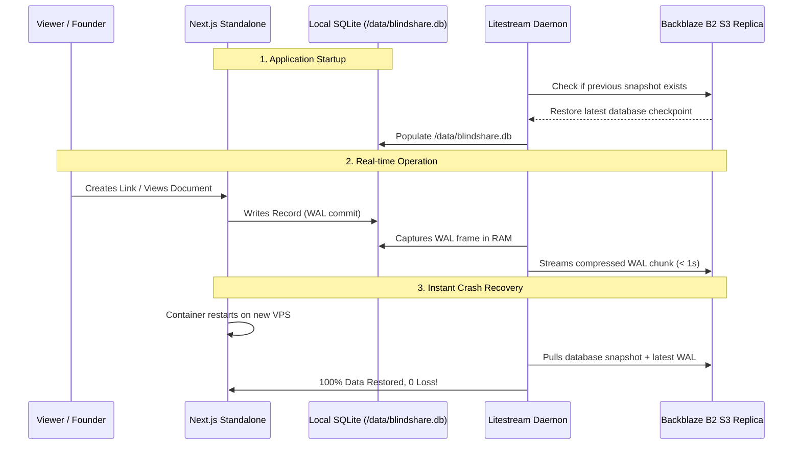

# Zero-Cost Self-Hosting Guide (SQLite + Litestream + Backblaze B2)

This guide walks you through deploying BlindShare on any low-cost or free VPS (Hetzner, DigitalOcean, Fly.io, Railway, Raspberry Pi) with **$0 Database Hosting Costs** using SQLite and continuous real-time WAL replication to **Backblaze B2**.

---

## 🌟 Why SQLite + Litestream + Backblaze B2?

- 💰 **100% Free Database Tier:** SQLite runs locally in single-digit microsecond latency without paying for managed PostgreSQL clusters.
- 🛡️ **Zero Data Loss:** Litestream streams every transaction (WAL) to a private Backblaze B2 bucket in sub-second intervals.
- 🔄 **Instant Disaster Recovery:** If your VPS is destroyed or rebooted, Litestream automatically restores the latest database snapshot from B2 upon boot in $< 2$ seconds.
- 📦 **10 GB Free Storage:** Backblaze B2 provides 10 GB free cloud storage with free egress via Cloudflare CDN.

---

## 🚀 Quickstart: Docker Compose (1-Command Deployment)

### 1. Configure Environment Variables
Create a `.env` file in the project root:

```ini
NEXT_PUBLIC_APP_URL=https://share.yourdomain.com
DATABASE_DRIVER=sqlite
DATABASE_URL=file:/data/blindshare.db
SESSION_SECRET=your_super_secret_64_character_hex_key_here

# Backblaze B2 Credentials (used for both encrypted document storage and DB WAL replication)
B2_KEY_ID=005xxxxxxxxxxxxxxxxxx
B2_APPLICATION_KEY=K005xxxxxxxxxxxxxxxxxxxxxxxxx
B2_BUCKET_NAME=your-private-blindshare-bucket
B2_ENDPOINT=s3.us-east-005.backblazeb2.com
```

### 2. Launch with Docker Compose
Run the following command:

```bash
docker compose -f deploy/docker-compose.yml up -d --build
```

---

## 🔍 How Litestream Operates Under the Hood



---

## 🛠️ Useful Management Commands

### Check Replication Status
```bash
docker exec -it blindshare-app litestream generations /data/blindshare.db
```

### Manually Restore Database to a Local File
```bash
litestream restore -config deploy/litestream.yml -o ./restored-blindshare.db /data/blindshare.db
```

### Verify Zero-Knowledge Encryption Invariant
Even though the database contains metadata, **all document bytes in B2 and all links remain 100% end-to-end encrypted** via client-side WebCrypto AES-GCM-256 keys in the URL fragment (`#k=...`).
---

## 📚 Related Documentation & Knowledge Base

- 🏠 **[Project Readme](../README.md)** — Core mission, feature list, and deployment presets.
- 🎨 **[Visual Architecture Blueprint](./visual.md)** — Architectural diagrams, dataflow, and crypto courier pipeline.
- 🏗️ **[Architecture Core](./ARCHITECTURE.md)** — Multi-cloud adapter specs, WebCrypto encryption flow, and data models.
- 🛡️ **[Security Policy](./SECURITY.md)** — Vulnerability disclosure, cryptographic invariants, and security headers.
- 🎯 **[Threat Model & Attack Surface](./THREAT-MODEL.md)** — Attack surface and honest residual risks.
- 📄 **[Supported File Formats](./FORMATS.md)** — File format handling, client-side renderers, and size caps.
- 📖 **[Operations Runbook](./RUNBOOK.md)** — Production migrations, health checks, and debugging procedures.
- 🔑 **[Secrets Reference](./SECRETS.md)** — Comprehensive list of required and optional environment keys.
- 🧹 **[Data Retention Policy](./DATA-RETENTION.md)** — Free-tier retention policies and cleanup sweeps.
- 🚨 **[Incident Response Plan](./INCIDENT-RESPONSE.md)** — Compromise triage, key rotation, and containment runbooks.
- 🌊 **[Litestream Self-Hosting](./LITESTREAM-SELFHOSTING.md)** — Zero-cost SQLite continuous WAL streaming to B2.
- 📋 **[Changelog & Patch Logs](./CHANGELOG.md)** — Chronological release history and version tracking.
- 📦 **[Release Process](./RELEASES.md)** — SemVer versioning and tagging protocol.
- 🔒 **[Privacy Policy](./PRIVACY-POLICY.md)** & ⚖️ **[Terms of Service](./TERMS.md)** — Privacy commitments and legal terms.
- 🤝 **[Contributing Guide](./CONTRIBUTING.md)** & 👥 **[Code of Conduct](./CODE_OF_CONDUCT.md)** — Community development pledge.
- 🧠 **[Architecture Skill](./skills/blindshare-architecture/SKILL.md)** — Definitive agent standards and verification checklist.
