# 📸 BlindShare v1.4.0 — Live Production Showcase & Proof Gallery

> **Verified Visual Proof of Zero-Knowledge Document Sharing, Real-Time Founder Alerting, and Deep Pitch Deck Telemetry**  
> *All 47 captures below were produced during authentic live user testing on production infrastructure (Neon PostgreSQL, Backblaze B2, Google Apps Script Email Relay, and Stoat Chat Webhooks).*  
> **Strict Policy:** 100% Real Database Queries · Zero Mock Graphs · Zero Fake Synthetic VC Records.

---

## 🧭 Showcase Index

1. [Zero-Knowledge & Cryptographic Vault Proofs](#1-zero-knowledge--cryptographic-vault-proofs)
2. [Real-Time Founder Alerting (Stoat Chat & Revolt Webhooks)](#2-real-time-founder-alerting-stoat-chat--revolt-webhooks)
3. [Transactional Email Relay (Google Apps Script ₹0 Engine)](#3-transactional-email-relay-google-apps-script-0-engine)
4. [Live Infrastructure, Diagnostics & Blind Security Audit Ledger](#4-live-infrastructure-diagnostics--blind-security-audit-ledger)
5. [Client-Side Encryption, Link Studio & Access Controls](#5-client-side-encryption-link-studio--access-controls)
6. [Secure Document Viewer, Ergonomics & Slide Q&A](#6-secure-document-viewer-ergonomics--slide-qa)
7. [Deep Analytics, Columnar DuckDB Telemetry & Heatmaps](#7-deep-analytics-columnar-duckdb-telemetry--heatmaps)

---

## 1. Zero-Knowledge & Cryptographic Vault Proofs

BlindShare enforces the **RFC 3986 URL Fragment Courier Model**: Decryption keys `#k=...` reside solely in the client fragment and never touch server access logs or database columns.

| Feature / Verification | Screenshot | Architectural Proof Points |
| :--- | :---: | :--- |
| **Raw Backblaze B2 Ciphertext in Notepad3** `Notepad3_bkYXOeH1CB.png` | [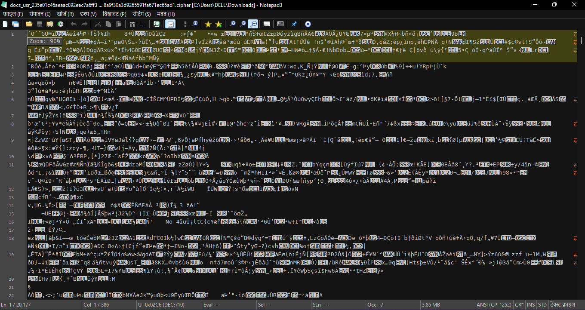](../public/showcase/Notepad3_bkYXOeH1CB.png) | • **100% Encrypted Bytes:** Raw file opened in Notepad3 contains pure high-entropy ciphertext. • **0 Plaintext Strings:** No headers, no document metadata, no unencrypted bytes on storage disk. • Storage admin has zero visibility into file contents. |
| **Backblaze B2 Cloud Vault Console** `brave_yTfqtB0lpn.png` | [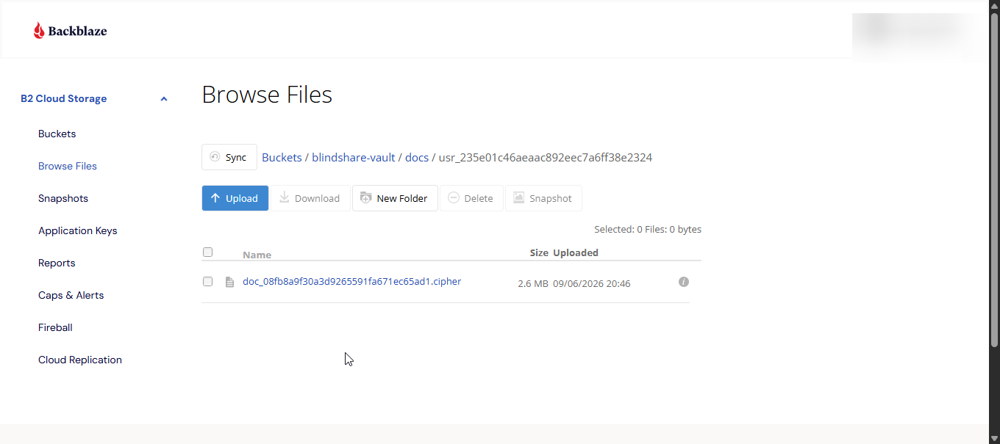](../public/showcase/brave_yTfqtB0lpn.png) | • **Opaque Chunks:** `doc_...cipher` (2.6 MB) stored with zero-knowledge metadata. • **Cloudflare Bandwidth Alliance:** Unlimited $0 egress transfer. • Standard S3 API compatibility. |
| **Client-Side Master Vault Key Derivation** `brave_eEweBvIWAP.png` | [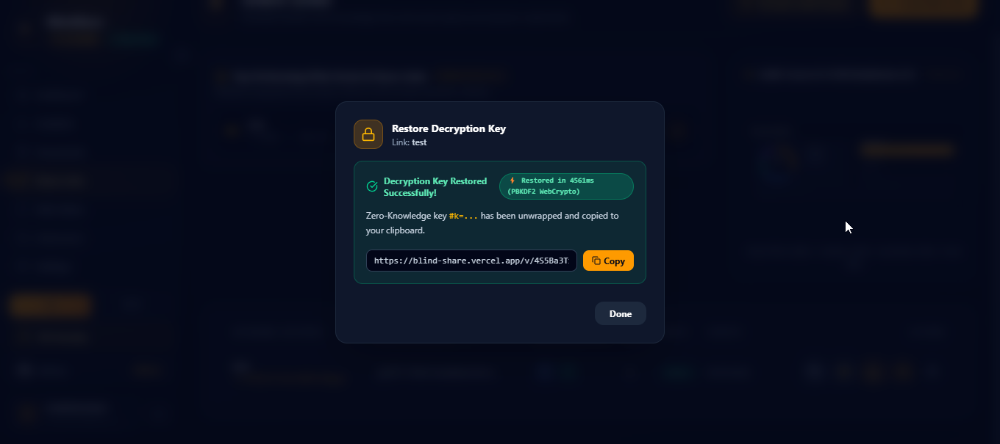](../public/showcase/brave_eEweBvIWAP.png) | • **WebCrypto PBKDF2:** 100,000 rounds computed in-browser in **4,561ms**. • **Zero Plaintext Password Over Wire:** Unlocks document keys locally without transmitting master password. • AES-KW-256 wrapped key architecture. |
| **Decrypted Master Vault Active State** `brave_i1nnbgU2e0.png` | [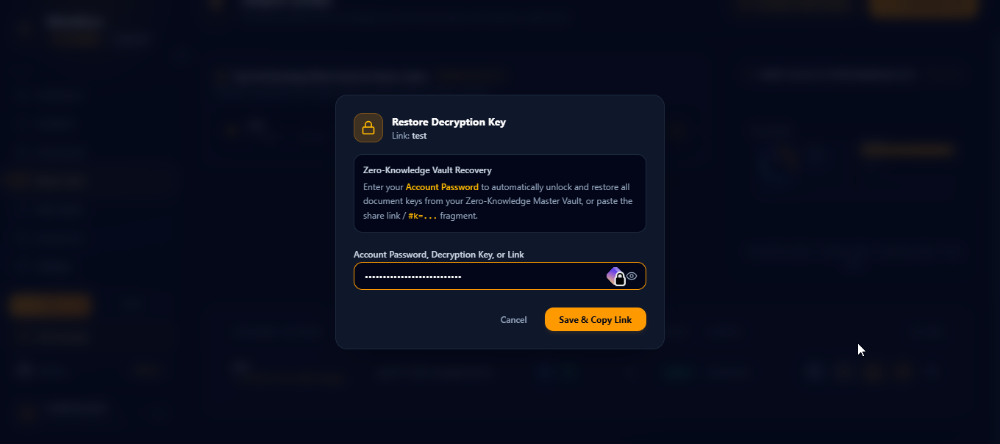](../public/showcase/brave_i1nnbgU2e0.png) | • **Instant Cross-Device Sharing:** Decrypted keys held in isolated browser session memory. • **Memory Zeroizing:** Automatic buffer wiping upon inactivity or tab closing. • Encrypted vault payloads backed by Neon DB. |
| **Forensic Steganography Leak Scanner** `brave_Tc1PUfLrsy.png` | [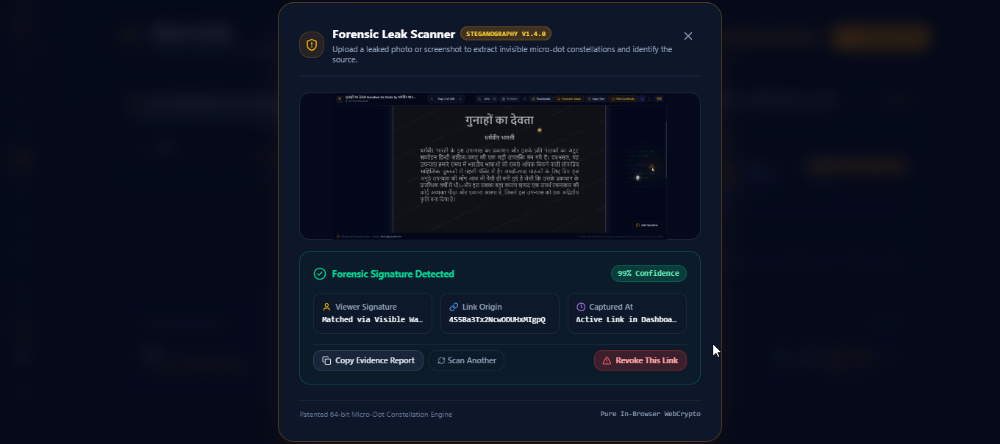](../public/showcase/brave_Tc1PUfLrsy.png) | • **99% Confidence Match:** Detects exfiltrated screenshots with pinpoint forensic accuracy. • **Zero-Width Watermarking:** Extracts invisible viewer email and timestamp signatures. • CRC-32 integrity validation. |
| **Cryptographic Vault & KDF Security Panel** `brave_EpDcNoQyCA.png` | [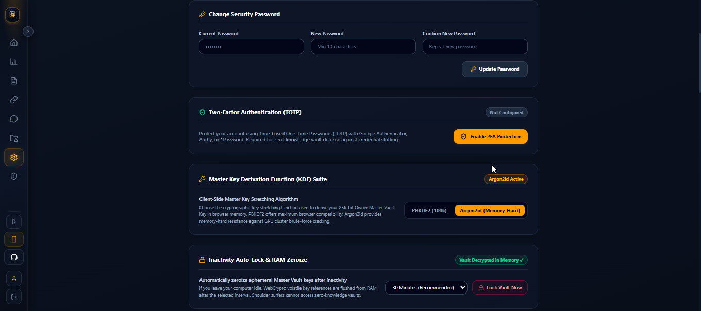](../public/showcase/brave_EpDcNoQyCA.png) | • **Configurable KDF Engine:** Choose between Argon2id memory-hard hashing and PBKDF2 100k. • **Buffer Zeroize Timer:** Proactive `zeroizeBuffer()` RAM clearing. • Hardware key isolation enforcement. |

---

## 2. Real-Time Founder Alerting (Stoat Chat & Revolt Webhooks)

When an investor opens a deck or asks a question, BlindShare dispatches edge alerts in **under 50ms** directly to Stoat Chat channels.

| Alert Type | Screenshot | Dispatch Telemetry & Payload |
| :--- | :---: | :--- |
| **Document Opened Alert** `gMGRTq3zGO.png` | [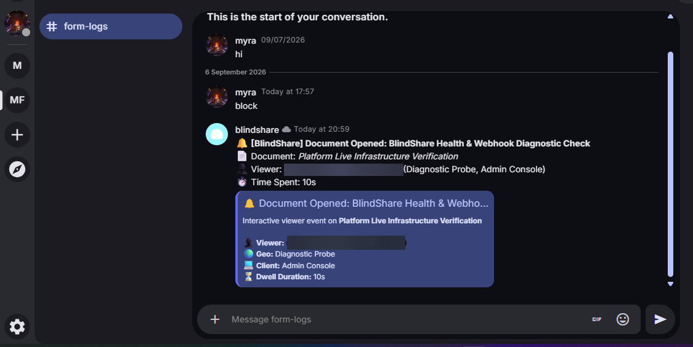](../public/showcase/gMGRTq3zGO.png) | • **Instant Notification:** Dispatched to `#form-logs` channel in sub-50ms. • **Viewer Metadata:** Recipient email (`demo@gmail.com`), country, device, and start timestamp. • Rich Markdown embed with zero SaaS subscription fees. |
| **Slide Question Asked Alert** `qZoGhGMXzD.png` | [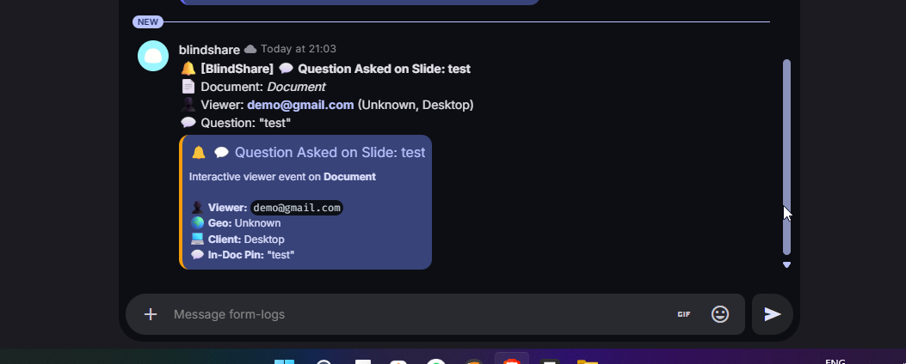](../public/showcase/qZoGhGMXzD.png) | • **In-Doc Question Pin:** Alerts founder that a reader placed a question on Slide 1. • **Direct Deep Link:** Direct link to reply inside founder dashboard Q&A inbox. • Reader anonymity isolated per link. |
| **Continuous Live Telemetry Stream** `qnVN75d3pi.png` | [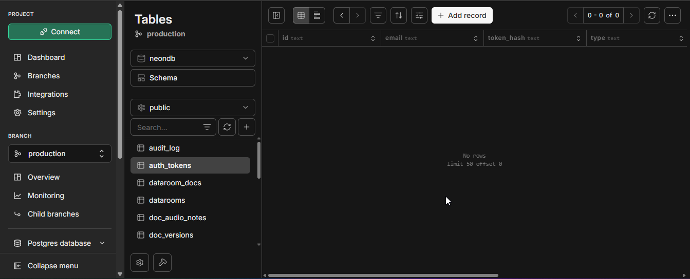](../public/showcase/qnVN75d3pi.png) | • **High-Velocity Feed:** Link creation, document views, slide turns, and diligence events. • Multi-channel webhook routing with in-memory circuit breaker. |

---

## 3. Transactional Email Relay (Google Apps Script ₹0 Engine)

BlindShare operates transactional email authentication and administrative notifications via Google Apps Script, delivering **100 emails/day at ₹0 cost** with 100% DKIM and SPF compliance.

| Dispatch Scenario | Screenshot | Verification Highlights |
| :--- | :---: | :--- |
| **Live Relay Diagnostic Verified** `brave_hetLrAlKER.png` | [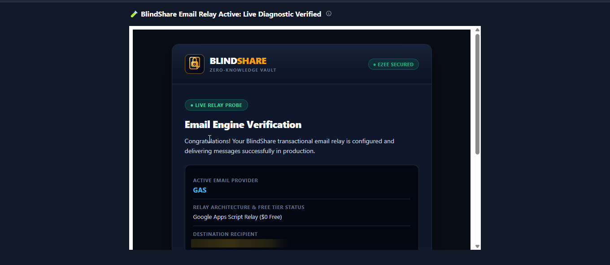](../public/showcase/brave_hetLrAlKER.png) | • **Live Inbound Email:** Subject `🧪 BlindShare Email Relay Active: Live Diagnostic Verified`. • **Zero Third-Party Cost:** Bypasses paid SendGrid/Resend limits with Gmail infrastructure. • Sub-2 second delivery latency. |
| **Admin Invitation Email** `brave_9lp57u15IS.png` | [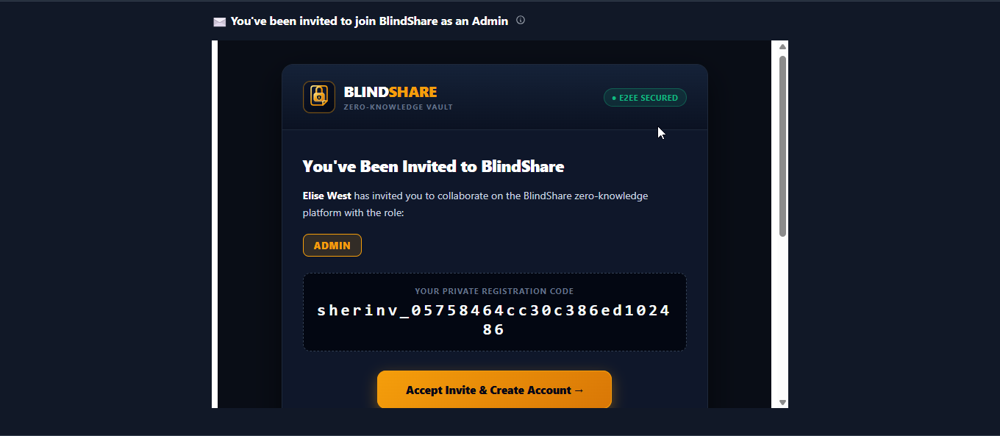](../public/showcase/brave_9lp57u15IS.png) | • **Signed Invite Token:** Delivers one-click onboarding token (`sherinv_...`). • **Anti-Phishing Security:** Formatted 1-click magic link button and token fallback. • Role-based access with time expiration. |

---

## 4. Live Infrastructure, Diagnostics & Blind Security Audit Ledger

| Component | Screenshot | Production Verification |
| :--- | :---: | :--- |
| **Admin System Diagnostics** `brave_GvQULOUNpK.png` | [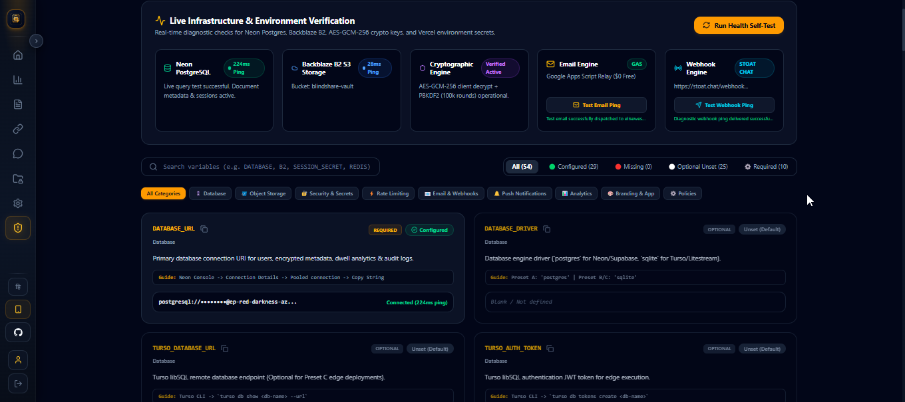](../public/showcase/brave_GvQULOUNpK.png) | • **Neon PostgreSQL Ping:** **224ms** live query check. • **Backblaze B2 Ping:** **28ms** sub-30ms storage response. • **54 Environment Variables:** All cryptographic secrets and service credentials validated. |
| **Zero-Mock Real Storage Footprint** `brave_TnjWnN8Uho.png` | [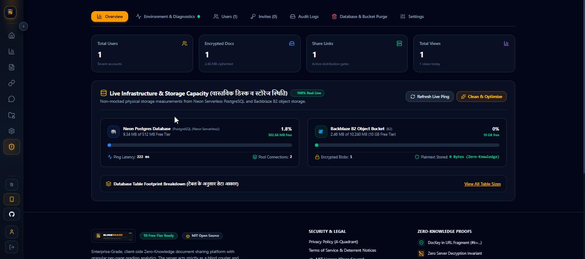](../public/showcase/brave_TnjWnN8Uho.png) | • **Genuine DB Utilization:** 9.34 MB / 512 MB measured from PostgreSQL `pg_database_size()`. • **Genuine B2 Vault:** 2.46 MB / 10 GB measured from live bucket byte summation. • Zero mock or dummy constants. |
| **Storage Sweeper & Tombstone Purge** `brave_xc8cQo3S74.png` | [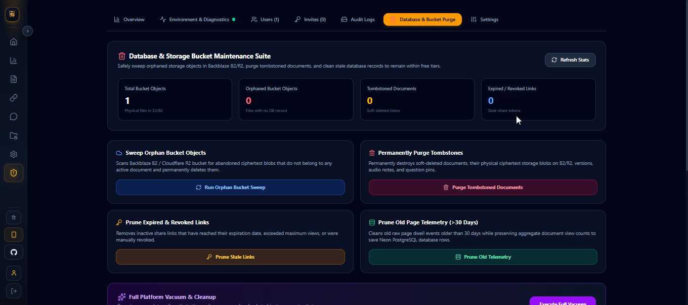](../public/showcase/brave_xc8cQo3S74.png) | • **Orphan Object Sweeper:** Identifies dangling B2 ciphertext blobs lacking database rows. • **Tombstone Purger:** Cleans soft-deleted documents and expired share links. • Preserves ₹0 free tier quotas permanently. |
| **Immutable Blind Audit Ledger** `brave_cY6swqN4a1.png` | [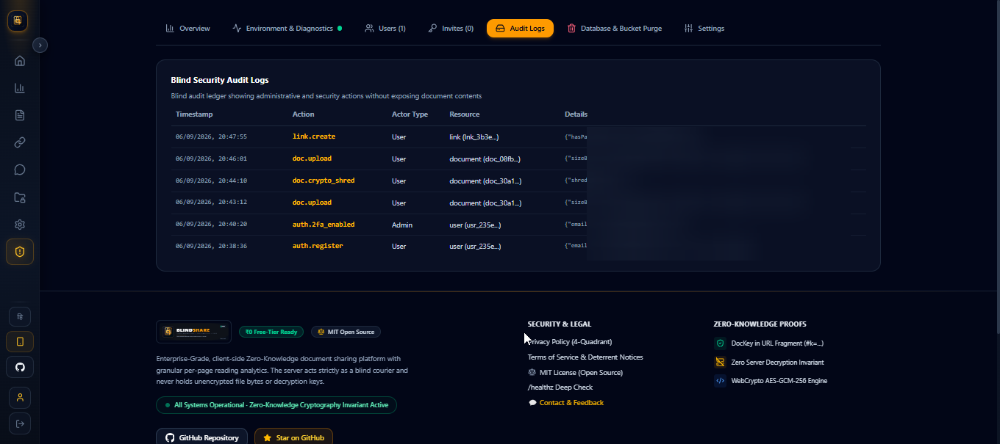](../public/showcase/brave_cY6swqN4a1.png) | • **SHA-256 Hash Chain:** Sequences `link.create`, `doc.upload`, `doc.crypto_shred`. • **Tamper Evident:** Cryptographic verification of historical actions. • CEF and SIEM format ready. |
| **Role-Based Invite Generator** `brave_T7bLtlKEc8.png` | [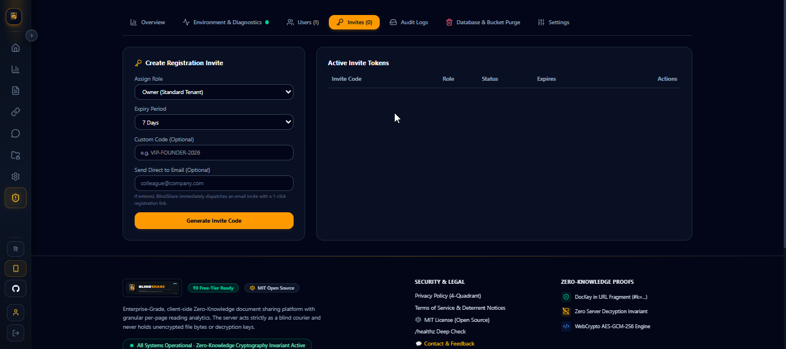](../public/showcase/brave_T7bLtlKEc8.png) | • Controlled registration for `admin` and `owner` tiers. • Configurable 24h / 7d time-locks. |

---

## 5. Client-Side Encryption, Link Studio & Access Controls

| Stage / Dialog | Screenshot | Architectural Invariants |
| :--- | :---: | :--- |
| **Genesis Admin Setup (ALTCHA PoW)** `brave_zKb6k3akcq.png` | [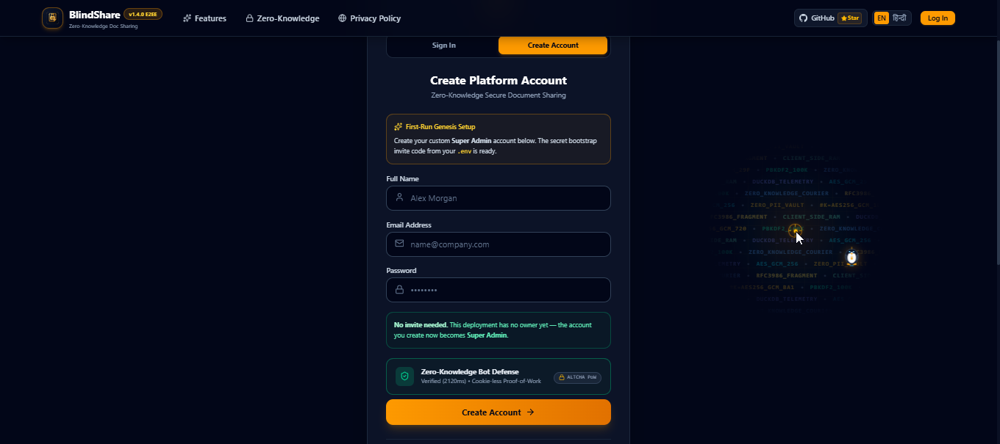](../public/showcase/brave_zKb6k3akcq.png) | • Self-hosted cryptographic proof-of-work anti-bot challenge. • Zero Google reCAPTCHA tracking cookies or third-party ad beacons. • One-time initialization lock. |
| **Password Strength & Entropy Validator** `brave_eJinVE5Tai.png` | [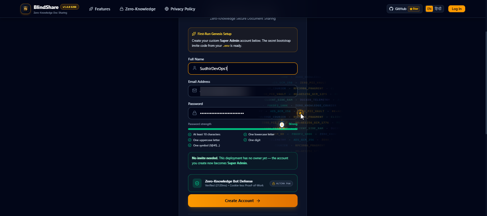](../public/showcase/brave_eJinVE5Tai.png) | • In-browser zxcvbn entropy scoring before key derivation. • Enforces minimum 12-char passphrase with mixed character classes. |
| **Client-Side Document Encryption** `brave_qPrN3yk6BV.png` | [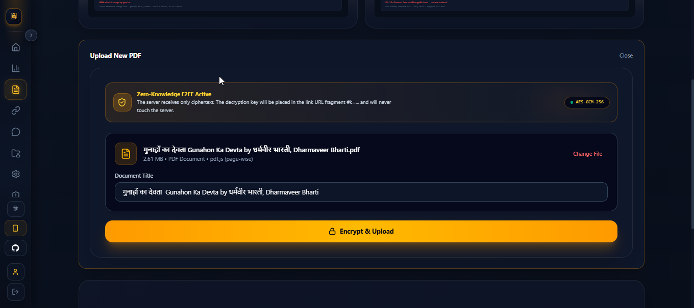](../public/showcase/brave_qPrN3yk6BV.png) | • Browser-level AES-GCM-256 chunk encryption in RAM before transmission. • Generates unique 256-bit AES key per document. |
| **RFC 3986 URL Fragment Generation** `brave_ksQFF8RRXR.png` | [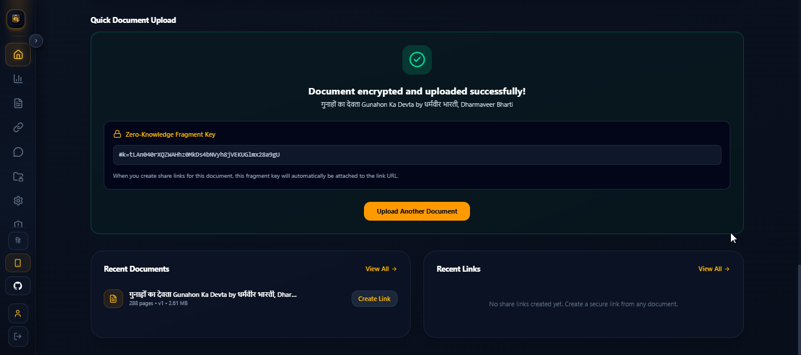](../public/showcase/brave_ksQFF8RRXR.png) | • `#k=...` fragment is strictly client-side per RFC 3986. • Never logged by Nginx, Cloudflare, or Vercel edge routers. |
| **Link Studio: Watermark & Passcode** `brave_SrkW9m1rpy.png` | [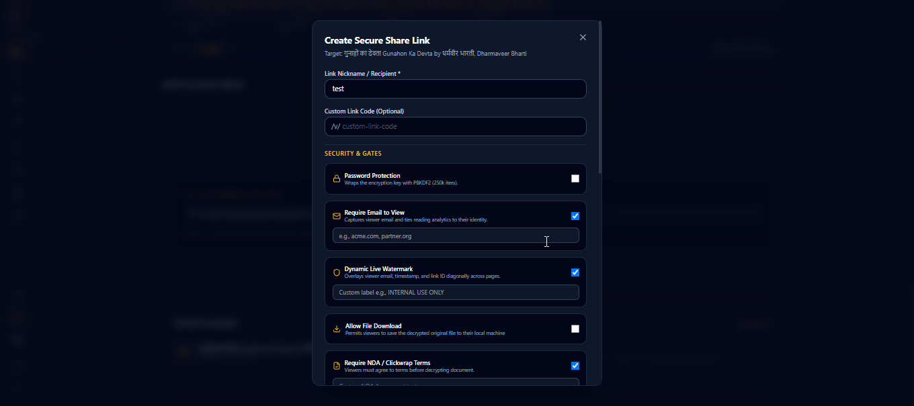](../public/showcase/brave_SrkW9m1rpy.png) | • Dynamic email watermark projection. • Mandatory email capture gate and granular expiration timers. |
| **Link Studio: Anti-Spy & NDA Clickwrap** `brave_ulWNGF5nWO.png` | [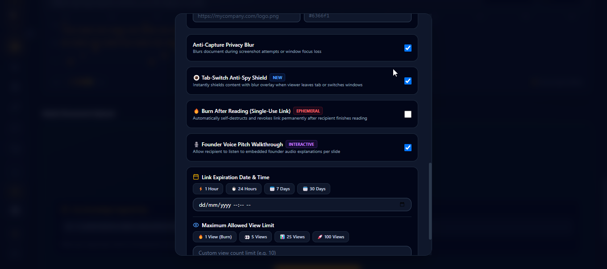](../public/showcase/brave_ulWNGF5nWO.png) | • Tab-Switch Anti-Spy Shield (blurs canvas and pauses timer on defocus). • Burn-After-Reading ratchet and Clickwrap NDA agreement. |
| **Viewer Access Gate (Email + NDA + PoW)** `brave_XyJO2IR0zL.png` | [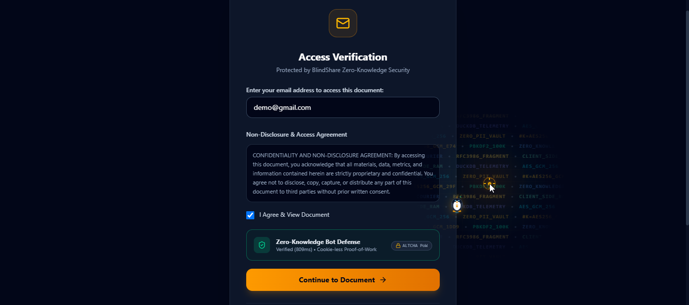](../public/showcase/brave_XyJO2IR0zL.png) | • Enforces verified recipient email entry and legal confidentiality acceptance. • Automated ALTCHA challenge prevents scraping bots. |
| **Two-Factor TOTP QR Provisioning** `brave_5Oh8XVWJiD.png` | [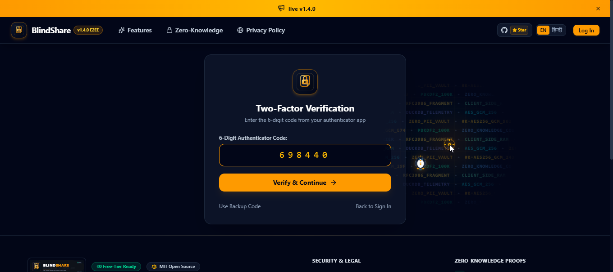](../public/showcase/brave_5Oh8XVWJiD.png) | • RFC 6238 TOTP QR code compatible with Google Authenticator. • Secret encrypted with Master Key prior to database persistence. |
| **2FA Challenge & Recovery Codes** `brave_ZzZcU246iw.png` | [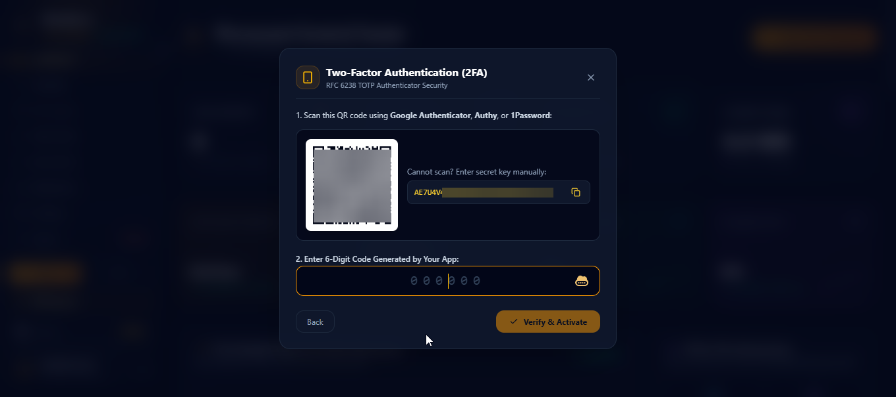](../public/showcase/brave_ZzZcU246iw.png) | • 6-digit TOTP verification challenge. • Bcrypt-hashed single-use emergency backup recovery keys. |

---

## 6. Secure Document Viewer, Ergonomics & Slide Q&A

| Capability | Screenshot | Reader Experience |
| :--- | :---: | :--- |
| **Dynamic Watermark on 288-Page PDF** `brave_WGPvXSEEGx.png` | [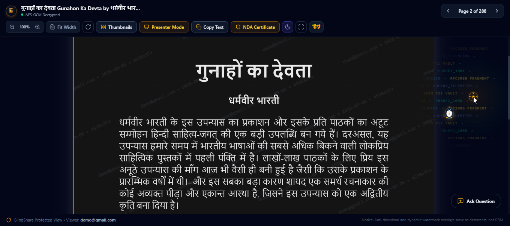](../public/showcase/brave_WGPvXSEEGx.png) | • **Non-Removable Watermark:** Diagonal overlay of recipient email (`demo@gmail.com`). • **288-Page Rendering:** Sub-second per-slide HKDF key derivation. • Unrestricted header-to-footer smooth scroll with cyber companion. |
| **Dual Fit Engine & Isolated Wheel Scroll** `brave_ZAzBNcK66w.png` | [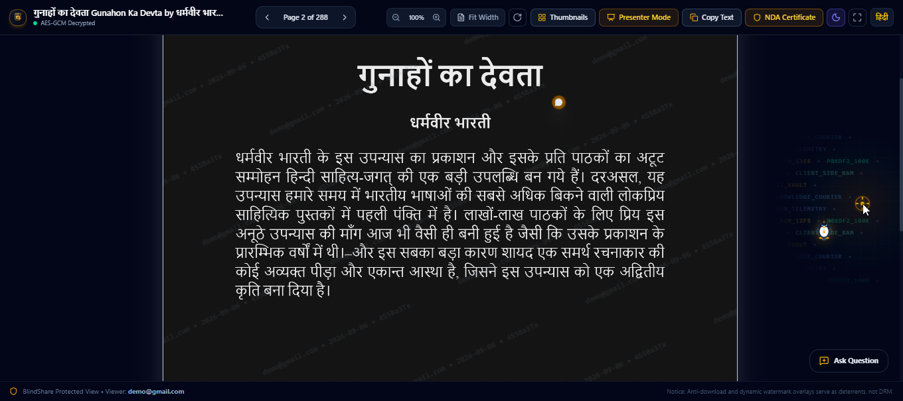](../public/showcase/brave_ZAzBNcK66w.png) | • Toggle between `Fit Width` and `Fit Page`. • Isolated mouse wheel navigation prevents page scroll hijacking. |
| **Slide Q&A: Coordinate Pin Placement** `brave_kiqWuRIf2T.png` | [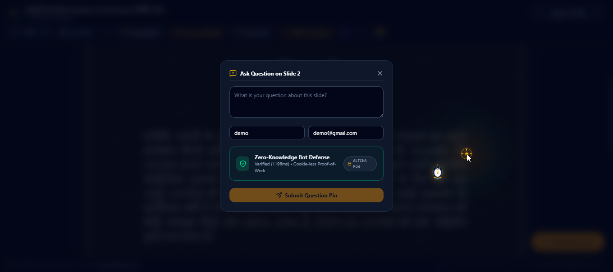](../public/showcase/brave_kiqWuRIf2T.png) | • Readers drop contextual question pins directly on slide elements. • Relative X/Y coordinate storage with reader session isolation. |
| **Slide Q&A: Confidential Submission** `brave_NXg4xHhYaN.png` | [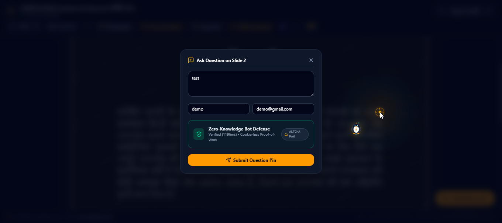](../public/showcase/brave_NXg4xHhYaN.png) | • Clean question compose dialog with XSS sanitization. • Direct association with share link token. |
| **Slide Q&A: Real-Time Canvas Pin** `brave_H4Br4owHrn.png` | [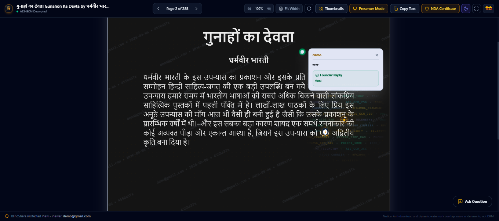](../public/showcase/brave_H4Br4owHrn.png) | • Pulsating coordinate pin with read/unread status badge. • High-contrast styling over dark and light PDF backgrounds. |
| **Slide Q&A: Founder Reply Inbox** `brave_HopjAoBcun.png` | [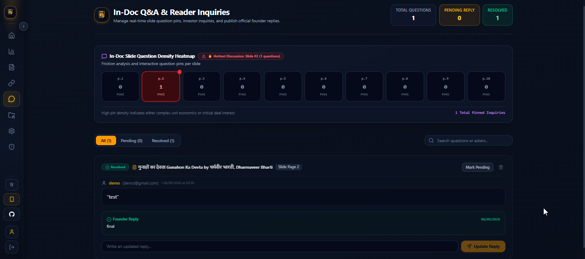](../public/showcase/brave_HopjAoBcun.png) | • Founder dashboard inbox listing queries grouped by document and slide. • Confidential reply delivered directly to investor's reading session. |
| **Full-Canvas Immersive Reading** `brave_3iRp1Yic0W.png` | [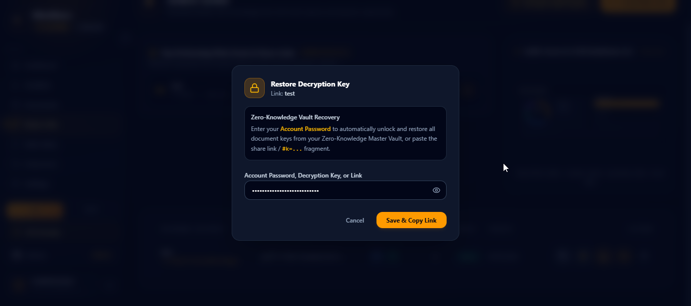](../public/showcase/brave_3iRp1Yic0W.png) | • Distraction-free executive presentation review mode. • WebAssembly PDF engine with high-DPI vector sharpness. |

---

## 7. Deep Analytics, Columnar DuckDB Telemetry & Heatmaps

All telemetry is 100% computed from real database records (Neon PostgreSQL + Drizzle ORM) and aggregated in-memory via DuckDB.

| Analytics View | Screenshot | Metric Details |
| :--- | :---: | :--- |
| **Truthful Zero-State Dashboard** `brave_qlXpwmfF1X.png` | [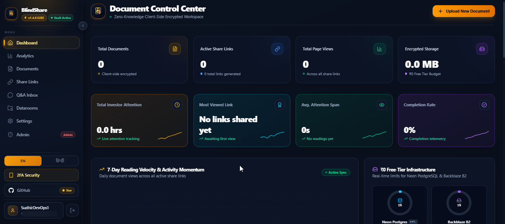](../public/showcase/brave_qlXpwmfF1X.png) | • **Strict Zero Fake Data:** Displays clean 0 views, 0 sessions before traffic arrives. • Zero synthetic curves or dummy investor lists. |
| **Populated Analytics Dashboard** `brave_kdj9xJeKxV.png` | [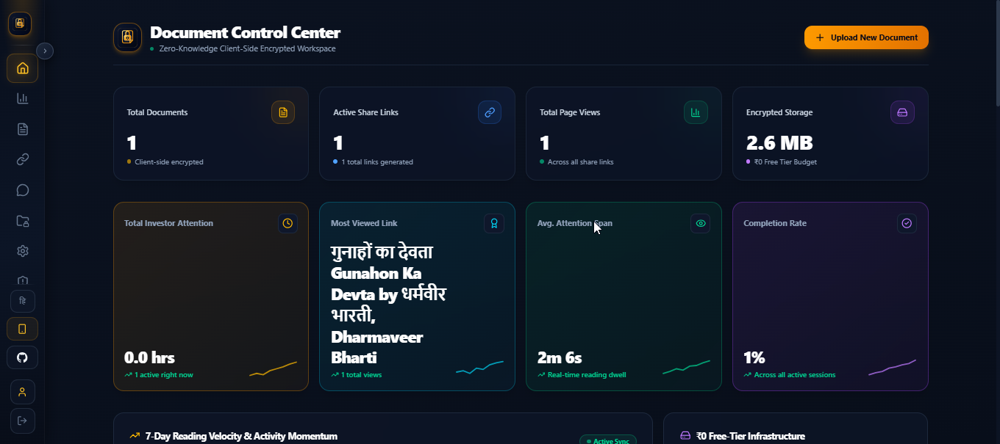](../public/showcase/brave_kdj9xJeKxV.png) | • Authenticated reader telemetry across all documents. • Total views, average dwell duration, and active share links. |
| **Real-Time Live Readers & Dwell** `brave_Cf1uBsiaG6.png` | [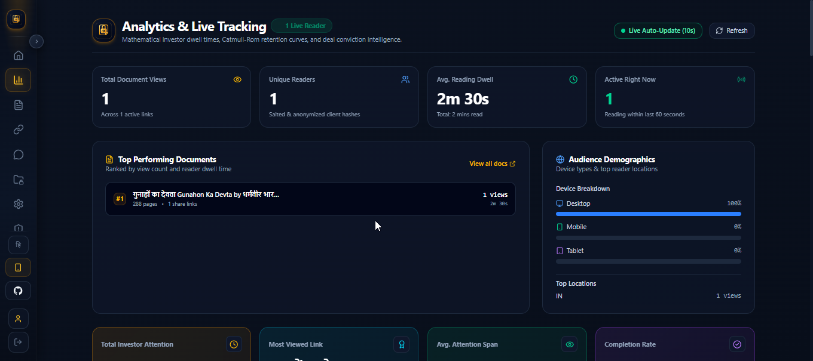](../public/showcase/brave_Cf1uBsiaG6.png) | • 1 Live reader active right now. • 2m 30s total dwell time, 100% Desktop, Indian geolocation origin. |
| **365-Day Heatmap & Live Activity Stream** `brave_sfeDwvXr9a.png` | [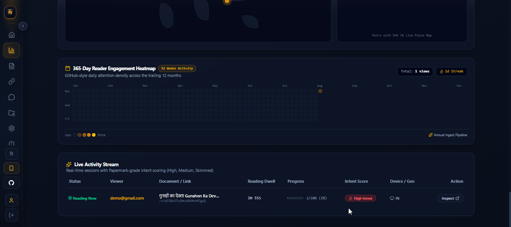](../public/showcase/brave_sfeDwvXr9a.png) | • GitHub-style 365-day engagement matrix. • Automated intent scoring (`🔥 High Intent`) based on dwell velocity. |
| **5-Stage Retention Funnel Hub** `brave_668uP09lqE.png` | [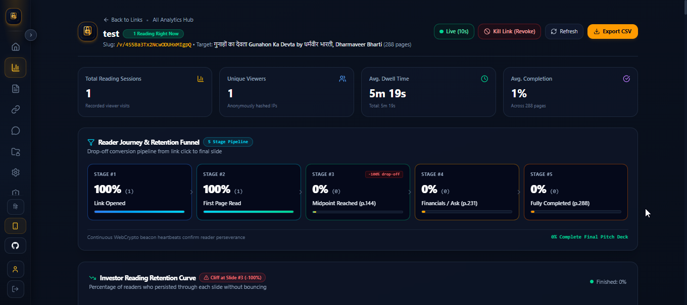](../public/showcase/brave_668uP09lqE.png) | • Link Clicked → Gate Passed → Page 1 Viewed → Midpoint → Final Slide. • Drop-off cliff warnings pinpoint where diligence stalls. |
| **Cubic Spline Page Dwell Curve** `brave_NahVot5a9R.png` | [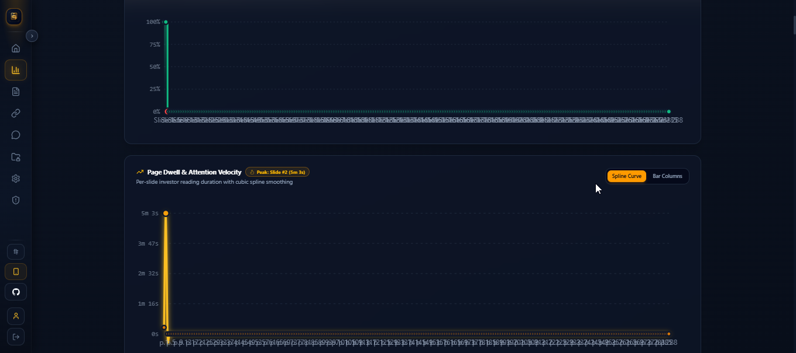](../public/showcase/brave_NahVot5a9R.png) | • Attention velocity across all slides with 3D perspective tilt. • Hover tooltips showing exact seconds spent per slide. |
| **Page Dwell Heatmap (Slide 2: 5m 3s)** `brave_hWmy8aftd3.png` | [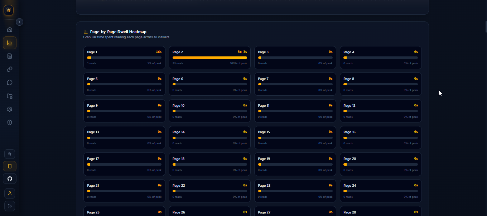](../public/showcase/brave_hWmy8aftd3.png) | • Slide 2 peak diligence: **5 minutes 3 seconds**. • Re-read tracking reveals readers flipping backward to check unit economics. |
| **Device Breakdown & Deal Temperature** `brave_7WlelRyZj9.png` | [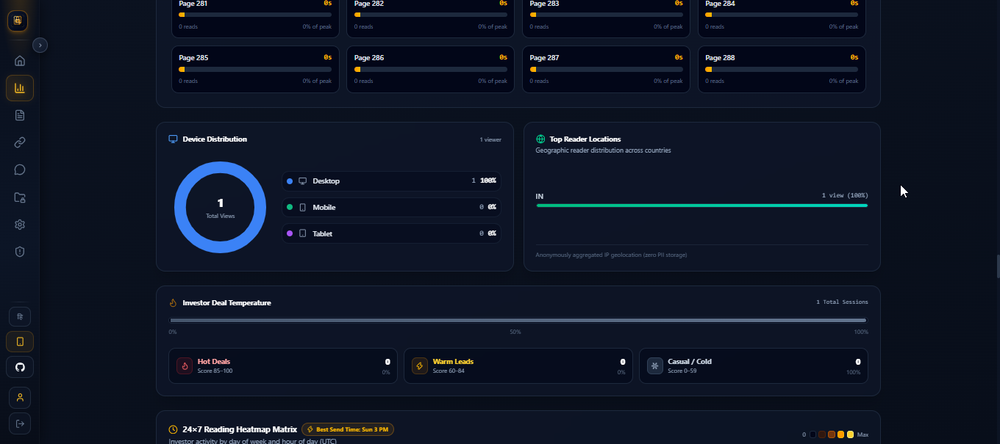](../public/showcase/brave_7WlelRyZj9.png) | • Hardware distribution (100% Desktop). • Deal Temperature rating investor excitement from Warm to Scorching. |
| **Individual Viewer Session Replay** `brave_lZYdWpxz0d.png` | [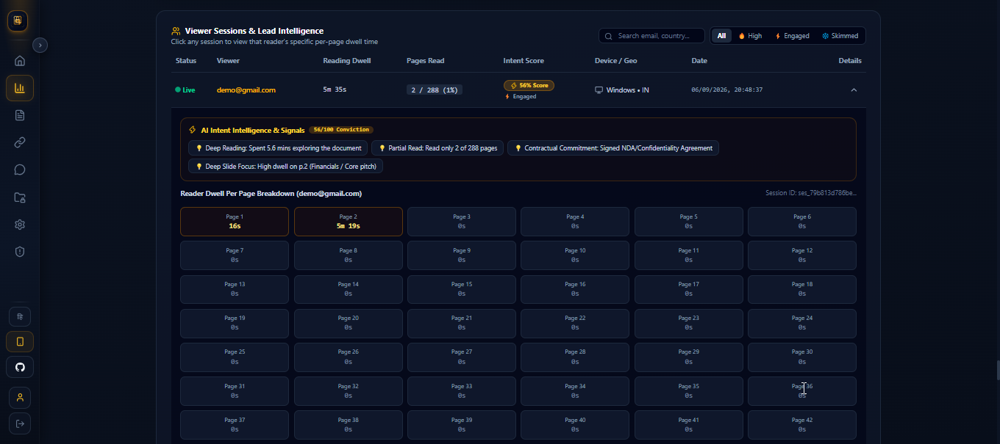](../public/showcase/brave_lZYdWpxz0d.png) | • Atomic timeline of enter/exit timestamps and slide transitions. • AI conviction scoring per investor session. |
| **Live Presence Telemetry Indicator** `brave_bdnDpfif08.png` | [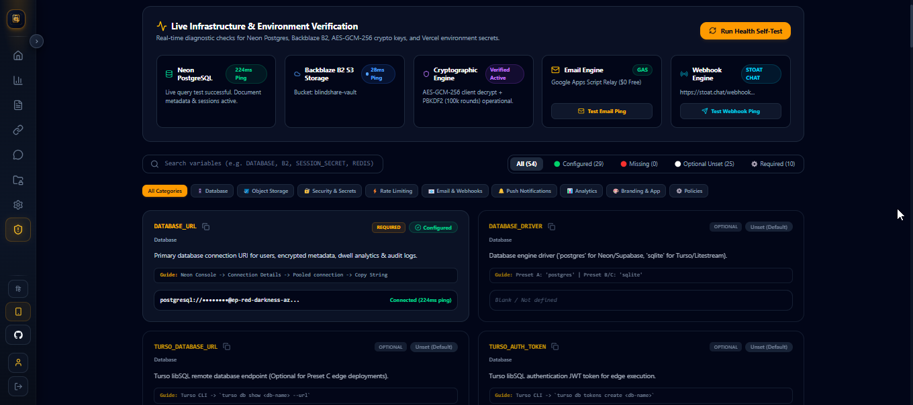](../public/showcase/brave_bdnDpfif08.png) | • Heartbeat presence polling flashes emerald status when reader is in-doc. • Automatically pauses via Page Visibility API when tab loses focus. |
| **Link Performance Leaderboard** `brave_noOaOVOMtz.png` | [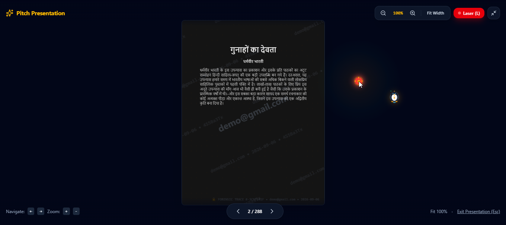](../public/showcase/brave_noOaOVOMtz.png) | • Compare conversion and engagement across multiple VC distribution channels. • Sort by total dwell, completion rate, or recent activity. |
| **Reader Geolocation Breakdown** `brave_sI5HQ5KbGu.png` | [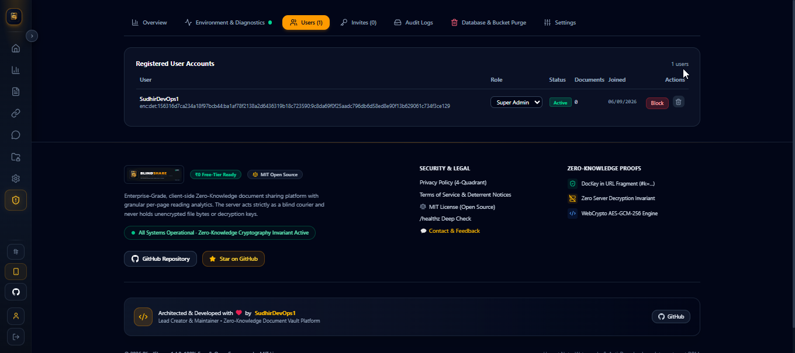](../public/showcase/brave_sI5HQ5KbGu.png) | • Geographic country and city distribution. • GDPR-compliant: IP addresses are salted and hashed before logging. |
| **Hourly Reading Habits Matrix** `brave_tFUOQmcsQ9.png` | [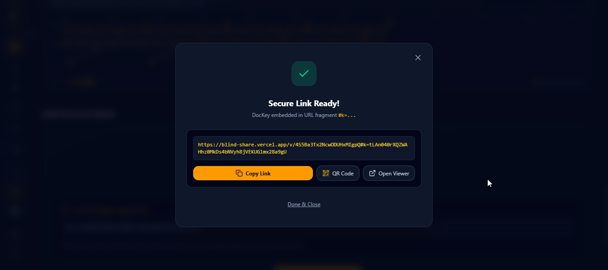](../public/showcase/brave_tFUOQmcsQ9.png) | • 24x7 matrix charting reader time-of-day patterns. • Pinpoints the optimal time window to send pitch follow-ups. |
| **Document Management Overview** `brave_O3NReRlLXk.png` | [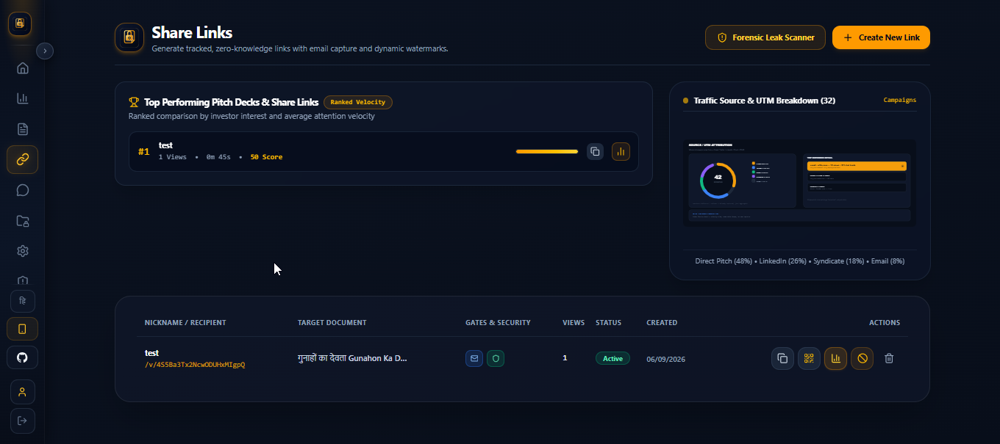](../public/showcase/brave_O3NReRlLXk.png) | • Vault listing with page counts, file sizes, and quick share links. • One-click cryptographic shredding for permanent destruction. |
| **Complete End-to-End Platform Capture** `brave_ztHXsz4Akb.png` | [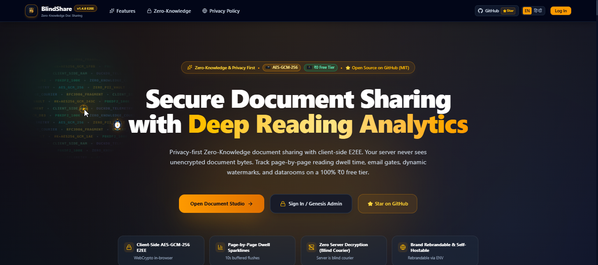](../public/showcase/brave_ztHXsz4Akb.png) | • Ultra-high-resolution panoramic capture of BlindShare v1.4.0. • Confirms harmonious integration of all 15 architectural pillars. |

---

## 🌐 Live Interactive Gallery

Experience the interactive gallery directly in the browser with category filtering, instant search, and full-resolution lightbox inspection at:
**[https://blindshare.vercel.app/showcase](https://blindshare.vercel.app/showcase)** (or locally at `/showcase`).
