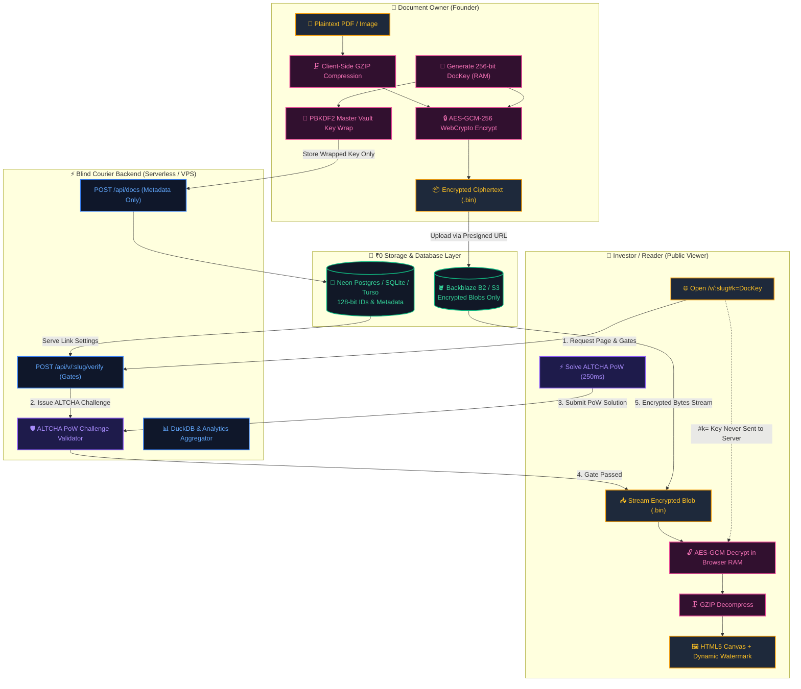
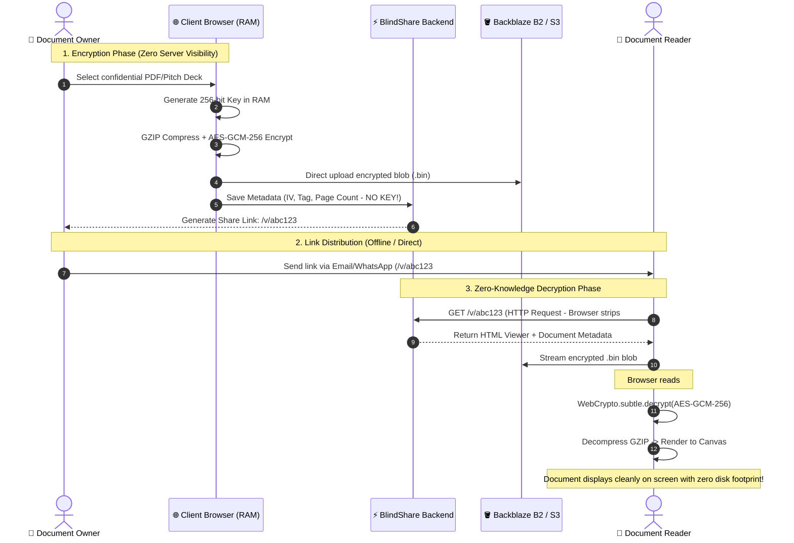
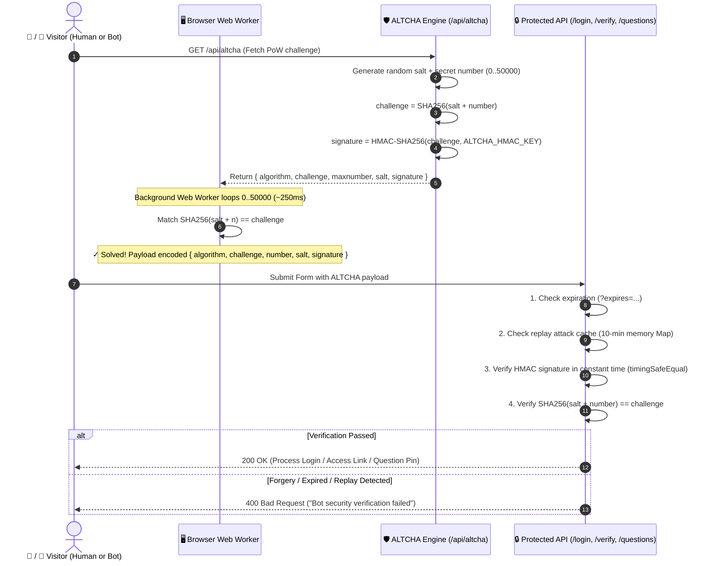
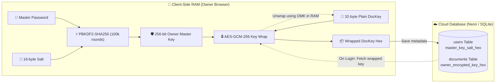
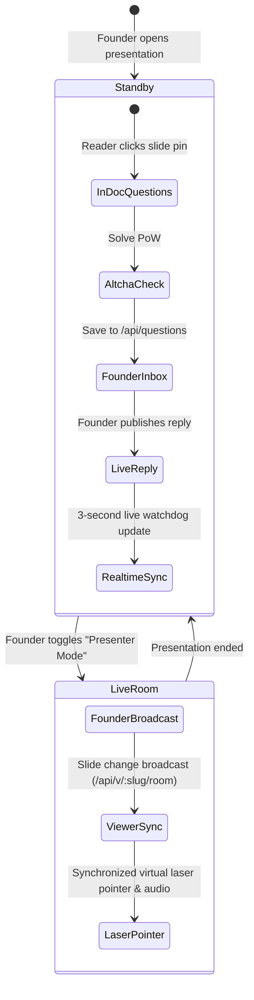

# 🎨 BlindShare Architecture & Security Visual Blueprint (`v1.4.0`)

> **Zero-Knowledge Secure Document Sharing, Digital Data Room & Pitch Deck Analytics Platform**

---

## 🧭 1. Complete End-to-End Platform Architecture



---

## 🔒 2. Zero-Knowledge Courier Model (RFC 3986 `#k=` Fragment)



---

## 🛡️ 3. ALTCHA Self-Hosted Proof-of-Work (PoW) Architecture



---

## 🏛️ 4. Owner Master Key Vault (Cross-Device Zero-Knowledge Sync)



---

## 📡 5. Interactive Slide Q&A & Live Presentation Room



---

## 💰 6. Three ₹0 Free-Tier Deployment Presets

```text
┌────────────────────────────────────────────────────────────────────────────────────────┐
│                        BLINDSHARE ₹0 FREE-TIER PRESETS                                 │
├───────────────────────┬────────────────────────────────┬───────────────────────────────┤
│ PRESET A: CLOUD       │ PRESET B: DOCKER / VPS         │ PRESET C: CLOUDFLARE EDGE     │
├───────────────────────┼────────────────────────────────┼───────────────────────────────┤
│ 🚀 Vercel / Render    │ 🐳 Self-Hosted Docker          │ ⚡ Cloudflare Pages           │
│ 🐘 Neon Postgres      │ 🗄️ SQLite + Litestream         │ 🌐 Turso libSQL Edge          │
│ 🪣 Backblaze B2 (S3)  │ 🪣 B2 Continuous WAL Stream    │ 🪣 B2 Bandwidth Alliance      │
│ 💰 $0 / Month         │ 💰 $0 / Month                  │ 💰 $0 / Month (0 Egress Cost) │
└───────────────────────┴────────────────────────────────┴───────────────────────────────┘
```

---

## 🛡️ 7. Security Invariant Matrix

```text
+---------------------------------------------------------------------------------------+
| INVARIANT 1: Zero-Knowledge Fragment (#k=...) never touches server logs or databases. |
| INVARIANT 2: 128-bit random tokens (genId) eliminate IDOR & enumeration attacks.      |
| INVARIANT 3: Timing-safe HMAC & PoW comparisons (crypto.timingSafeEqual).             |
| INVARIANT 4: SSRF engine blocks private RFC-1918 subnets & cloud metadata endpoints.  |
| INVARIANT 5: Automated 24/24 enterprise security tests pass on every build.           |
+---------------------------------------------------------------------------------------+
```

---

## 📚 Related Documentation & Knowledge Base

- 🏠 **[Project Root & Overview](../README.md)** — Core mission, feature list, and deployment presets.
- 🏗️ **[Architecture Core](./ARCHITECTURE.md)** — Multi-cloud adapter specs, WebCrypto encryption flow, and data models.
- 🛡️ **[Security Policy](./SECURITY.md)** — Vulnerability disclosure, cryptographic invariants, and security headers.
- 🎯 **[Threat Model & Attack Surface](./THREAT-MODEL.md)** — Attack surface and honest residual risks.
- 📄 **[Supported File Formats](./FORMATS.md)** — File format handling, client-side renderers, and size caps.
- 📖 **[Operations Runbook](./RUNBOOK.md)** — Production migrations, health checks, and debugging procedures.
- 🔑 **[Secrets Reference](./SECRETS.md)** — Comprehensive list of required and optional environment keys.
- 🧹 **[Data Retention Policy](./DATA-RETENTION.md)** — Free-tier retention policies and cleanup sweeps.
- 🚨 **[Incident Response Plan](./INCIDENT-RESPONSE.md)** — Compromise triage, key rotation, and containment runbooks.
- 🌊 **[Litestream Self-Hosting](./LITESTREAM-SELFHOSTING.md)** — Zero-cost SQLite continuous WAL streaming to B2.
- 📋 **[Changelog & Patch Logs](./CHANGELOG.md)** — Chronological release history and version tracking.
- 📦 **[Release Process](./RELEASES.md)** — SemVer versioning and tagging protocol.
- 🔒 **[Privacy Policy](./PRIVACY-POLICY.md)** & ⚖️ **[Terms of Service](./TERMS.md)** — Privacy commitments and legal terms.
- 🤝 **[Contributing Guide](./CONTRIBUTING.md)** & 👥 **[Code of Conduct](./CODE_OF_CONDUCT.md)** — Community development pledge.
- 🧠 **[Architecture Skill](./skills/blindshare-architecture/SKILL.md)** — Definitive agent standards and verification checklist.
